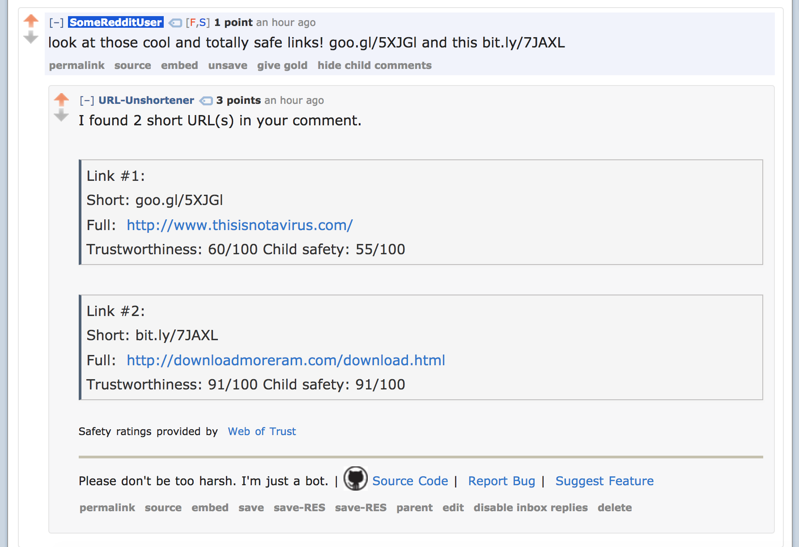

## Reddit URL Unshortener
A bot that reveals full URL hidden behind shortened URLs in comments/posts on Reddit.com

### Screenshot

### Credits
This application uses Open Source components. You can find the source code of their open source projects along with license information below. We acknowledge and are grateful to these developers for their contributions to open source.

* [PRAW v4 (Python Reddit API Wrapper)](https://github.com/praw-dev/praw) Copyright (c), 2016, Bryce Boe (2-clause BSD license)
* [Pushshift.io Reddit-API v2](https://pushshift.io/) 2016, Jason Baumgartner ([Twitter](https://twitter.com/jasonbaumgartne))
* [ShortURL-Services-List](https://github.com/sambokai/ShortURL-Services-List) 2016, S. Bokai (Feel free to use/contribute!)
